# **云顶修仙 2.0 新手引导**

## 1. 登录篇

- 1.1.一般登录 
  地址：http://yundingxx.com:3366/login 
  直接输入账号密码，即可登录，没有账号则会自动创建账号并进行登录。
  以上的登录方式需要输入验证码。如果掉线重现失败后，重新登录则需要继续输入验证码。这点对于多开玩家很不友好，因此有下面第二登录方法
- 1.2.多开 
  一般可以使用浏览器自带的小号模式、隐私模式进行多开游戏。此处比较推荐 Chrome 浏览器搭配 SessionBox 插件进行多开游戏。

## 2. 界面篇

- 网页主要分为 6 个部分： 

  1.  基本信息：显示人物的货币、状态、任务、装备
  2.  大地图窗口：包括滚动全服消息、人物大地图、副本战斗界面
  3.  功能窗口：人物所有相关功能
  4.  日志窗口：包括战斗日志、物品日志、公告日志
  5.  聊天窗口：包括各频道聊天记录和全服消息
  6.  页面显示设置：对于页面进行自定义设置

- 2.1.基本信息 
  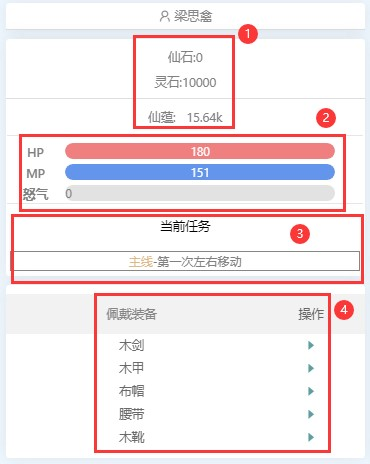

  - 货币相关:
    > 仙石为玩家之间、玩家与系统之间的交易货币，来源：任务（其中 10 级主线任务奖励 1000 仙石）、分解某些副本的掉落物品、玩家之间交易。 
    > 灵石为玩家与系统之间的交易货币，来源副本战斗胜利、分解副本掉落物品。 
    > 仙蕴为自动累计，可以转换为气血储备、魔法储备、活力值，仙蕴越多转换率越高。
  - 状态相关:
    > HP：气血值，目前战斗中除了技能的回复气血值，还没有其他手段回复。当气血储备小于等于 0 时，每场副本战斗的气血值将会锁定为 100，而且副本战斗获得的经验有一定衰减。 
    > MP：魔法值，目前没有手段能在战斗中回复魔法值。当魔法储备小于等于 0 时，每场副本战斗的魔法值都会为 0，而且无法使用需要魔法的技能，使用普攻代替。 
    > 怒气：在副本战斗中会增加，每场副本战斗重新计算。怒气值目前可以用于使用装备上带有特技。 
  - 任务相关: 
    > 目前任务分为：主线任务、帮派任务、每周任务，任务所需的材料数量不是实时刷新的，因此只要确认【储物戒指】中的材料数量满足，即可点击【完成任务】来获得任务奖励。 
    > 主线任务：通过升级而自动领取的任务，只有完成主线任务后，才能提升到更高级别。此类任务不能放弃。 
    > 帮派任务：通过加入帮派，在【聚仙楼阁】处领取。完成主要获得帮贡，帮贡用于升级生活技能。此类任务可以放弃。 
    > 每周任务：在【任务中心】处领取，完成后获得相对奖励。目前此类任务不能放弃，但不影响升级。 
  - 装备相关: 
    > 此处显示人物目前已穿戴的装备及其属性，点击【操作】出按钮即可将对应装备卸下回【储物戒指】。

- 2.2.大地图窗口 
  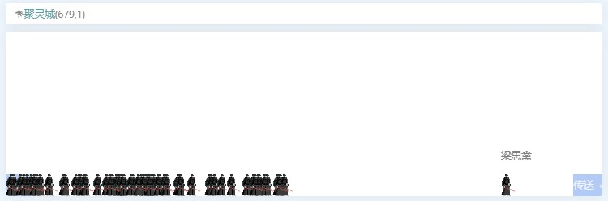 
  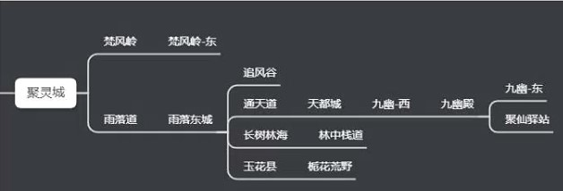 

  > 顶部左上角为当前地图名称及人物位置坐标，剩余空白位置为滚动全服消息显示位置。 
  > 通过操作键盘四个方向键和空格键/回车键，实现人物切换大地图。切换大地图等于切换玩家组队频道，在不同的大地图可以看到不同玩家的组队情况。 

  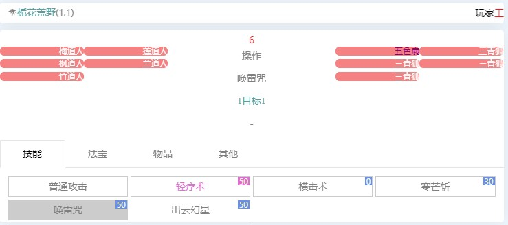 

  > 副本战斗界面，在操作倒计时完结前，玩家可以更改人物本回合的行动和目标。目标不选择的话，则为随机目标。 
  > 技能，显示所有玩家掌握的技能供玩家选择，包括装备的特技。玩家选择好，每回合人物优先使用已选技能。如魔法或怒气不足，则会使用普攻代替。 
  > 法宝，虽然已经开放，但目前没有人合成出来。法宝材料可以通过深渊幻境的灵妙宝箱、高级藏宝图获得。作者介绍一次获得后，只需要不断升级即可。 
  > 物品，目前并没有可以在副本战斗中使用的物品。 
  > 其他，目前只有捕捉一个功能。捕捉即为捕捉怪物为宠物，捕捉消耗魔法，不能越级捕捉高级怪物。捕捉可以通过商城道具或生活技能提高成功率。 

- 2.3.功能窗口 
   

  - 2.3.1.个人信息 
    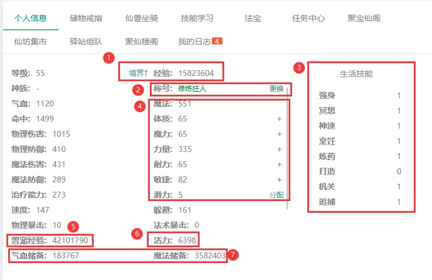 
    1. > 当前拥有的经验值，不会实时刷新，需要二次点击【个人信息】标签刷新。境界可以进行升级，查看下级所需经验。
    2. > 称号，目前只有 1.0 版本部分玩家拥有。已知称号：修炼狂人、再续前缘、乐善好施、智慧之人。2.0 的新称号需要作者后续添加。
    3. > 生活技能，显示生活技能的等级。打造技能疑似有问题不能白嫖 1 级。 4.主属性，五大属性，通过【+】分配，分配好后点击【分配】确认。同时【分配】处可以洗点，有一定等级基础的玩家洗点转修。目前主流枪修建议全魔加点，剑修建议全力。锤修伞修在版本没有大更新前不建议玩家使用。
    4. > 兽宠经验，宠物的经验池，用于宠物升级。玩家副本战斗获得经验的同时，兽宠经验也会增加。
    5. > 活力，目前可以用于放弃帮派任务，放弃一次消耗 10 点活力。后续推测为用于生活技能的使用消耗。
    6. > 气血与魔法储备，在副本战斗中会消耗。当气血储备小于等于 0 时，每场副本战斗的气血值将会锁定为 100，而且副本战斗获得的经验有一定衰减。当魔法储备小于等于 0 时，每场副本战斗的魔法值都会为 0，而且无法使用需要魔法的技能，使用普攻代替。目前可以通过使用物品和仙蕴转换回复气血和魔法储备。使用物品，可以通过商城购买或副本的掉落来获得。 
       > 因此，在长时间挂机前请确保人物气血和魔法储备足够，否则会导致挂机效率低下。
  - 2.3.2.储物戒指 
    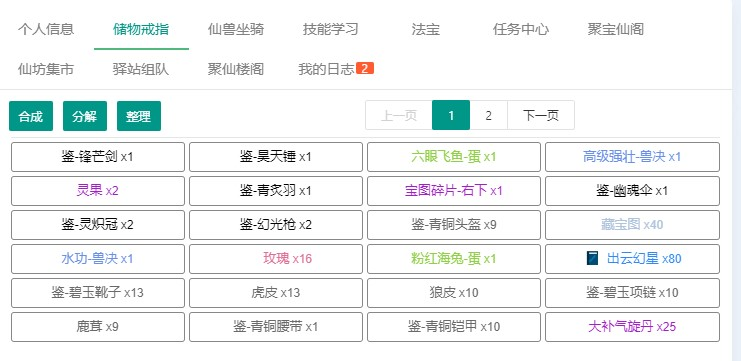 
    > 【储物戒指】，即为背包。物品的使用、分解、合成、整理都在这里完成。 
    > 物品使用，包括回复药的使用、未鉴定装备的鉴定、已鉴定装备的穿戴。 
    > 物品分解，基本所有物品都可以，分解可以得到一定灵石或者仙石。通过全选可以实现批量分解。 
    > 物品合成，目前能合成物品只有 50 级装备、粉红海兔蛋。可以批量合成，但是材料数量要成比例，建议谨慎使用批量>合成。如果材料在背包的不同的两页，目前没有办法可以。 
    > 物品整理，有时同类会分开两个格子，可以同整理将其合并为一个格子。 
  - 2.3.3.仙兽坐骑 
    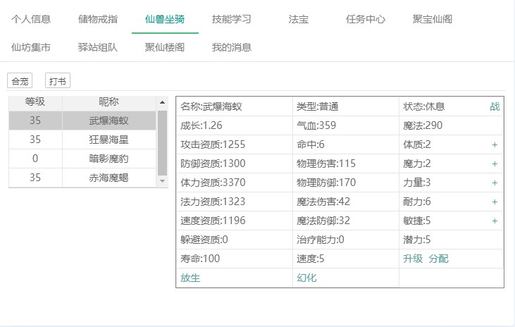 
    > 升级，宠物经验使用【个人信息】中的“兽宠经验”升级 
    > 放生，玩家不会得到任何反馈，只会失去一只宠物。 
    > 幻化，将宠物变为蛋，刷新宠物技能、资质、成长。 
    > 合宠，两只宠物合成一只，结果两只宠物情况而随机。 
    > 打书，给宠物使用兽诀，宠物有几率增加或替换一个技能。 
    > 目前，比较好用的宠物是荆棘之海的粉红海兔，但是需要通过合成提升得到一只满意的兔子难度大。神兽目前只能通过>和作者交流获得，不过真的强就是了。 
  - 2.3.4.技能学习 
    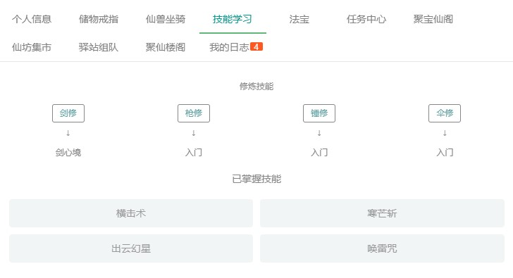 
    > 【技能学习】分为“修炼技能”和“已掌握技能”。 
    > 修炼技能，2.0 版本已经没有种族的区分，取而代之的四系修炼（剑、枪、锤、伞）。四系修炼会提升各系的特色属>性，剑修主物理、枪修主魔法、锤修主防御、伞修主辅助。目前主流为枪修、少量剑修。锤修和伞修因为版本原因不建>议修炼，可能后续版本完善后选修。 
    > 已掌握技能，是人物已经学习了的技能，可以在副本战斗中使用。技能是通过技能书方式学习。 
  - 2.3.5.法宝 
    > 虽然已经开放，但目前没有人合成出来。法宝材料可以通过深渊幻境的灵妙宝箱、高级藏宝图获得。作者介绍一次获得>后，只需要不断升级即可。 
  - 2.3.6.任务中心 
    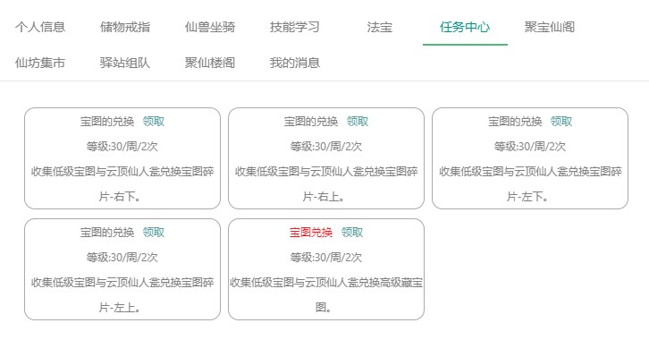 
    > 【任务中心】目前只有宝藏图相关任务。宝藏图碎片兑换任务，每个任务需要 3 个低级宝藏图，其中高级宝藏图的中碎>片在商城 1W 仙石购买或宝藏山副本掉落。高级宝藏图兑换任务，12 个低级宝藏图换 1 个高级宝藏图。 
  - 2.3.7.聚宝仙阁 
    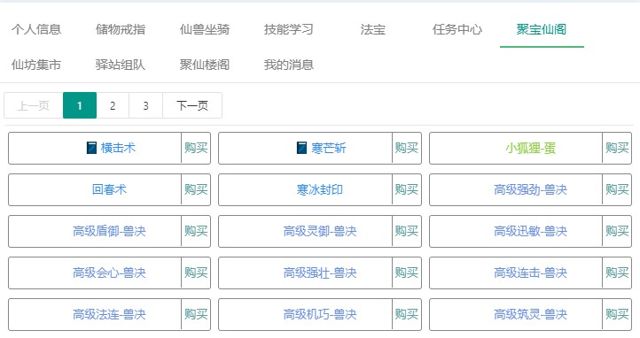 
    > 聚宝仙阁】，即为系统商城，主营高级兽诀、50 级武器装备材料、宠物捕捉工具，此外有少量低级技能书、低级宠物>蛋，气血魔法回复药。 
  - 2.3.8.仙坊市集 
     
    【仙坊市集】，即为玩家之间的交易市场，以仙石进行交易。一般物品只有 48 小时上架时间，超时后需要重新上架。玩家仙石来源渠道之一。 
  - 2.3.9.驿站组队 
    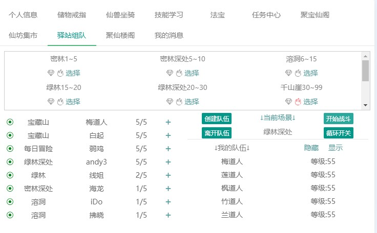 
    > 驿站组队】，玩家获取经验的地方。就算单刷，也需要创建队伍才可以。建议和高级玩家或同级玩家组队以提高升级效>率。目前队长不能踢人，没有队伍密码。其中荆棘之海、每日冒险、宝藏山为每日次数限制副本，挑战次数足够后不会>获得奖励，但可以继续挑战。深渊幻境为每周次数限制副本，一周两次。 
    > 新手切忌追求高级副本，升级快才是王道，很多时低级副本的秒经验比高级副本高。如果有材料装备需求，则根据需求>刷副本。 
  - 2.3.10.聚仙楼阁 
    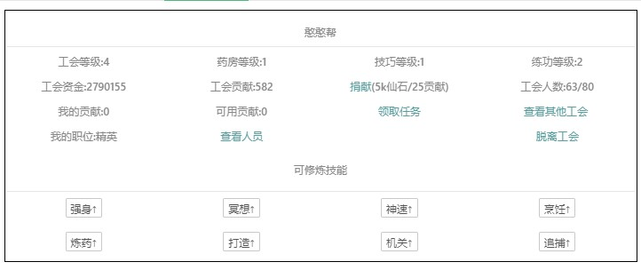 
    > 聚仙楼阁】，即为工会帮派，玩家在这里可以申请加入工会，等待帮主或副帮主通过即可。加入后，可以通过领取完成>帮派任务，获取帮派贡献。帮派贡献用于提升生活技能等级。脱离工会，自己可用贡献不会清零，可以带到新工会。 
    > 生活技能有强身、冥想、神速、烹饪、炼药、打造、机关、追捕。生活技能可以提高对应的属性。建议优先强身、冥>想、神速这三个可以战斗属性的。打造技能疑似有问题不能白嫖 1 级。 
  - 2.3.11.我的消息 
    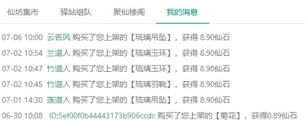 
    > 【我的消息】主要显示玩家之间的交易记录，目前只记录玩家本身的卖出记录。 

- 2.4.日志窗口 
  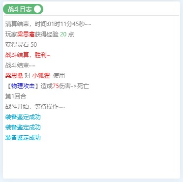 
  > 日志窗口，包括战斗日志、物品日志、公告日志三类。 
  > 战斗日志，可以通过开关实现精简战斗结果显示和详细战斗过程显示。 
  > 物品日志和公告日志则是对应在此处显示。但战斗日志会将物品日志和公告日志刷新掉。 
- 2.5.聊天窗口 
  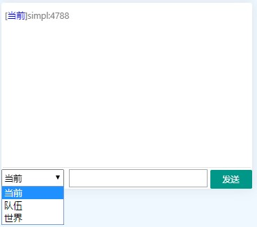 
  > 聊天窗口，包括各频道聊天记录和全服消息。 
  > 聊天窗口一共有当前、队伍、世界三个频道。当前频道，为当前大地图频道，该大地图内的玩家可见。队伍频道，为队伍>成员可见。世界频道，为全服所有玩家可见。 
  > 全服消息，当玩家达到一定等级、捕捉到一定级别的宠物、合宠合宠 7 技能以上的宠物、挖宝挖到一定级别的物品等等>时，进行全服通告。 
- 2.6.页面显示设置 
  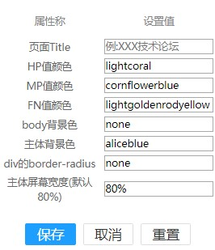 
  > 页面显示设置，根据玩家自己的需求，对页面进行自定义显示设置。设置完成需要刷新页面才能生效。 
- 2.7.排行榜 
  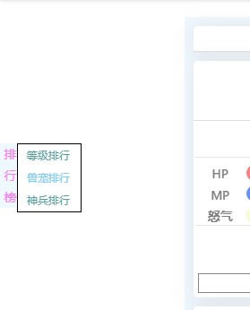 
  > 在页面左侧，分为等级、兽宠、神兵三个榜单。打开榜单，点击排行榜上的人物名字，即可查看人物各种信息。 
